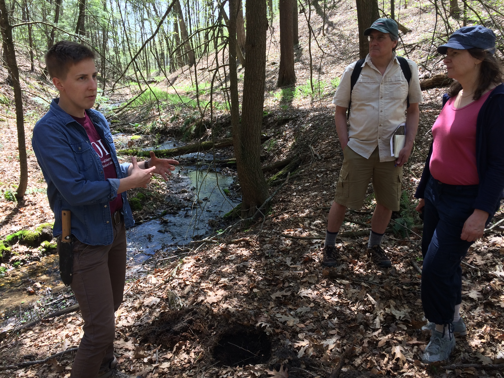

{: .center-image width="40%"}

I'm a soil biogeochemist and an advocate for open, inclusive, and communicative science. As a soil scientist, my interests lie in understanding the factors that control biogeochemical processes, from the micro- to the ecosystem-scale, as well as the myriad ways we manage and relate to soils.

I have a PhD in [Environmental Conservation](https://www.umass.edu/environmental-conservation/) from UMass Amherst. I also completed the [Graduate Certificate in Feminist Studies](https://www.umass.edu/women-gender-sexuality/academics/graduate/certificate) in the Department of Women, Gender, Sexuality Studies. Prior, ​I received an MS in Soils and Biogeochemistry from UC Davis, and worked as a Research Associate at the Pacific Northwest National Laboratory, where I studied soil carbon cycling in a permafrost ecosystem in Alaska.

My journey in soil science has immersed me in everything from building stormwater retention gardens and studying environmental politics, to leading soils field trips and uplifting diversity and equity in the sciences.
